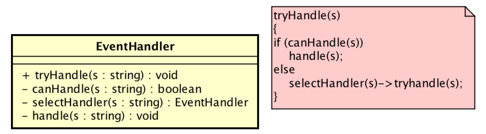
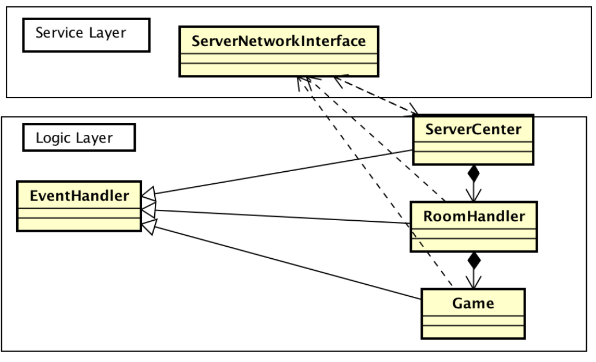

#狼人杀大作业报告文档
我们是第5小组，包括吴一凡(2016011269)、王晓智(2016011257)、王世因(2016011246)、李瀚祎(2016012084)、刘明明(2016011263)五人。在这篇文档中我们将汇报我们的OOP课程大作业的设计、功能和分工合作等情况。
##背景介绍
这个大作业的背景为经典的多人桌游“狼人杀”，是一个策略性和互动性都很强的游戏。基于这种游戏设定，我们决定实现一个支持多人在线对战的游戏以使用户不必见面仍可进行狼人杀游戏。
借鉴一些在线游戏平台的思路，我们认为还应加入“房间”设定，不同玩家可以在不同的房间进行游戏，且对人数、角色的设定应该交给玩家决定以体现定制性。
##需求分析
我们决定采用经典的Client-Server模式来实现在线对战系统，因此任务就可以被划分为开发一个可分发的桌面应用客户端和一个集中式的服务器端主程序。
为了优化性能同时防止客户端作弊等行为，我们决定由服务器端承担所有游戏逻辑，服务器端和客户端通过约定好的通信格式（见“逻辑主文档”）进行通信，并且客户端采用被动响应服务器指令的模式设计。
除了Client和Server的划分之外，另一个重要的组成部分是Client和Server之间的通信框架，我们需要封装一个简洁易用的通信模块来保证通信的正常进行。
客户端的主要工作在于易用的GUI以及能够响应服务器指令的简单逻辑。
因此主要编写任务可以分为通信模块、服务器逻辑、客户端GUI以及逻辑。
此外，为了实现房间功能以及支持多局游戏，我们决定采用完全异步的模式，这对于逻辑的实现是一个挑战。
##分工
王晓智负责实现服务器逻辑和参与架构设计。
吴一凡负责实现通信模块和客户端以及参与架构设计。
王世因负责实现客户端GUI和逻辑原型。
李瀚祎负责实现客户端原型和参与PPT制作。
刘明明负责设计界面，参与调试。
##框架设计
同需求分析中，整体划分为服务器逻辑，通信模块，客户端三部分。
服务器逻辑和客户端逻辑的主要设计模式为责任链模式，此外兼有装饰模式和代理模式等多种设计模式。
服务器逻辑的责任链模式类图可以参考下图，客户端逻辑在结构上类似。





##实现过程
###开源资源
我们的全部代码采用开源Qt框架开发，GUI用Qt实现，网络通信也用过QtSocket实现。
我们的代码采用Git进行版本控制并且托管在Github上，地址为https://github.com/Bakser/Werewolf 

###文档支持
我们在讨论过程中将讨论结果写成完善的文档，便于以后开发时查阅。
具体包括document文件夹里的
狼人杀规则文档（吴一凡）
OOPFramwork（吴一凡）
逻辑主文档（王晓智）
###编程技巧
首先我们将用户身份用唯一的ID表示，减少了维护复杂用户信息的开销和耦合。
为了实现完全异步的架构，我们在设计上采用了“包驱动”的模式，即服务器和客户端均在收到一定的指令/响应包后根据包的内容激活逻辑程序。虽然一定程度上增加了开发难度，但实现了异步功能，提高了安全性。
###核心模块
####通信模块
客户端网络接口为```newClient\clientnetworkinterface.h```及其实现的``.cpp``文件。

服务器网络接口为```Server\servernetworkinterface.h```及其实现的```.cpp```文件。

通信模块主要在这几个文件中实现。

####服务器逻辑
主要包括```Server```文件夹中的```eventhandler.h```,```ServerCenter.h```, ```RoomHandler.h```,```Game.h```,```Gamestatus.h```以及对应的cpp文件。
分别负责定义抽象类，定义服务中心类，定义房间类，定义游戏逻辑类和定义游戏状态类，具体功能与接口参见文件注释。
####客户端
主要包括```newClient```文件夹中网络接口以及各个界面的设计文件，具体功能与接口见程序中的注释。

## 如何测试

### 运行服务器

游戏服务器本来搭建在校内工业云上支持在线游戏，但在这里为了方便测试搭建在本地Localhost上。

直接build Server文件夹下项目运行即可。

### 运行游戏

在服务器运行的基础上，build newClient文件夹下项目运行即可。

##总结
在这次大作业中我们不仅实践了课上的C++的语法知识，还自学了Qt框架以及网络通信、GUI的相关内容。
令我感触最大的一点是设计思想和设计模式的重要性，责任链模式贯彻了我们整个程序的设计，此外在一开始我们设计上试图采用事件循环机制的局部阻塞的模式，最后发现并不能满足要求，并最终修改为完全异步的模式，这次大修给了我们很沉重的教训。
团队配合的能力也是我们在这次大作业中得到锻炼的一大部分，分工合作让我们都有很大收获。
​     